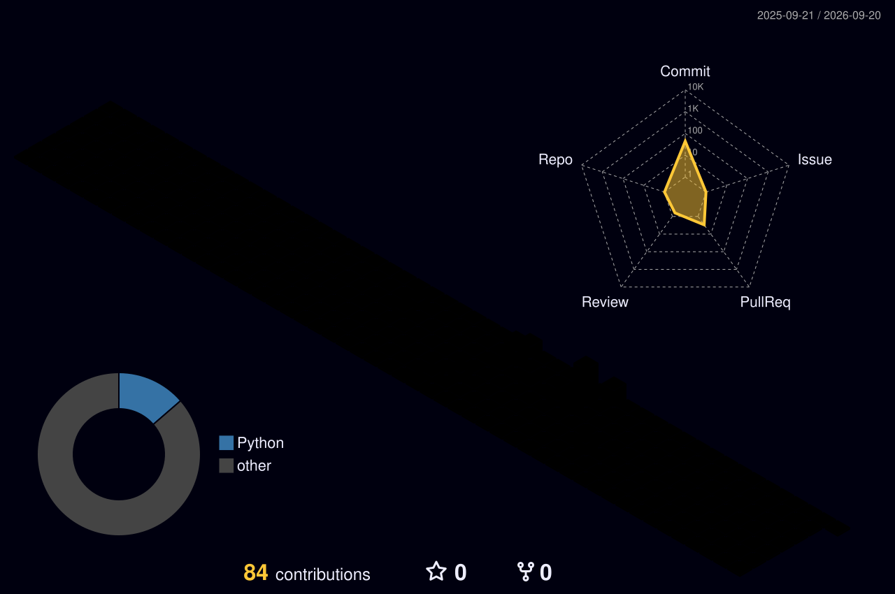

# Hey There! 👋
### English

### Turkish

  
<b>👨🏼‍💻Tech-stack</b>
 

#### Programing Languages

  

#### Frameworks & libraries

  

####  package manager

  

#### Source Control

  

#### CI/CD Pipeline

  

#### Containerization & Orchestration

  

#### Operating System

  

  
<b>⚙️ GitHub Analytics</b>
 

  

    
  

